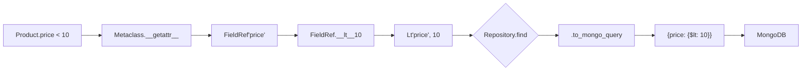

# Part 1: Typing MongoDB at the Speed of Thought

> How we built a type-safe query system for MongoDB that feels like native Python.

---

## The Problem

Every MongoDB ODM eventually asks you to write this:

```python
collection.find({"price": {"$lt": 10}, "status": {"$ne": "archived"}})
```

Strings. Everywhere. No autocomplete. No refactoring support. One typo — `"pirce"` instead of `"price"` — and you only find out at runtime.

For small projects this is fine. But as your schema grows to 20, 50, 100 fields, stringly-typed queries become a liability. Renaming a field means grep-and-pray. Your IDE can't help you. New team members learn field names by memorisation, not by discovery.

**We wanted something better.**

---

## The Vision

What if you could write queries like this instead?

```python
products = await repo.find(Product.category == "electronics", Product.price < 10)
```

And sort like this?

```python
products = await repo.find(sort=[Product.price.desc(), Product.name.asc()])
```

And aggregate like this?

```python
pipeline.group(Order.product_id, total_revenue={"$sum": Order.total})
```

No strings. No `"$lt"`. No remembering whether it's `"price"` or `"Price"`. Just Python operators on model fields.

---

## How It Works

### Step 1: The `FieldRef` Class

Every comparison operator (`<`, `>`, `==`, `!=`, `<=`, `>=`, `in`, `not in`, etc.) is overloaded on a `FieldRef` class. Instead of returning a boolean, each operator returns a query expression object.

Here's the core mechanism:

```python
class FieldRef:
    def __init__(self, name: str):
        self._field = name

    def __lt__(self, value: Any) -> QueryExpression:
        return Lt(self._field, value)   # → {"field": {"$lt": value}}

    def __gt__(self, value: Any) -> QueryExpression:
        return Gt(self._field, value)   # → {"field": {"$gt": value}}

    def __eq__(self, value: Any) -> QueryExpression:
        return Eq(self._field, value)   # → {"field": value}

    def __ne__(self, value: Any) -> QueryExpression:
        return Ne(self._field, value)   # → {"field": {"$ne": value}}
```

When you write `Product.price < 10`, Python calls `FieldRef.__lt__` which returns a **`Lt` expression object**. This object knows its field name and value, and can serialise itself to a MongoDB query dict at the last possible moment.

### Step 2: The Metaclass Magic

But wait — how does `Product.price` return a `FieldRef` in the first place? `Product` is a pydantic model class, not an instance. And pydantic v2 removes field names from `cls.__dict__` entirely.

The answer is a custom metaclass:

```python
class VellumMetaclass(ModelMetaclass):
    def __getattr__(cls, name: str):
        if name.startswith("_"):
            raise AttributeError(name)   # avoid infinite recursion
        fields = cls.__dict__.get("__pydantic_fields__", {})
        if name in fields:
            return FieldRef(name)
        raise AttributeError(f"{cls.__name__} has no attribute {name!r}")
```

When you access `Product.price`, Python's attribute lookup fails normally (pydantic stripped it), then falls through to `metaclass.__getattr__`. We intercept, check if `name` is a known field, and return a `FieldRef`.

The `_` guard is critical — pydantic's own internals probe the class for `_`-prefixed attributes, and without this check we'd get infinite recursion.

### Step 3: Composing Expressions

Real queries are rarely a single condition. You need `and`, `or`, `not`. With `FieldRef`, these map to Python's native operators:

```python
# AND
query = (Product.price < 10) & (Product.category == "electronics")

# OR
query = (Product.category == "food") | (Product.category == "drink")

# NOT
query = ~(Product.status == "archived")

# Mixed
query = (Product.price >= 10) & ((Product.tags == "sale") | ~Product.is_deleted())
```

Each `__and__`, `__or__`, `__invert__` returns a composed expression that serialises recursively:

```python
class And(QueryExpression):
    def __init__(self, *expressions):
        self._expressions = expressions

    def to_mongo_query(self):
        return {"$and": [e.to_mongo_query() for e in self._expressions]}
```

### Step 4: The Full Operator Suite

Beyond simple comparisons, `FieldRef` supports MongoDB's full query language through method calls:

| Python Syntax | MongoDB |
|---|---|
| `Product.tags == "sale"` | `{tags: "sale"}` |
| `Product.price < 10` | `{price: {$lt: 10}}` |
| `Product.price >= 5` | `{price: {$gte: 5}}` |
| `Product.tags.in_(["a", "b"])` | `{tags: {$in: ["a", "b"]}}` |
| `Product.tags.not_in(["x"])` | `{tags: {$nin: ["x"]}}` |
| `Product.tags.all_(["a", "b"])` | `{tags: {$all: ["a", "b"]}}` |
| `Product.tags.size(3)` | `{tags: {$size: 3}}` |
| `Product.tags.exists(True)` | `{tags: {$exists: true}}` |
| `Product.name.regex("^Laptop", "i")` | `{name: {$regex: "^Laptop", $options: "i"}}` |
| `Product.tags.elem_match(...)` | `{tags: {$elemMatch: ...}}` |

The full query flow looks like this:



### Step 5: Backward Compat with `FieldsProxy`

Some developers prefer an explicit `.fields` proxy for clarity or to avoid metaclass surprises. We support both:

```python
# Direct — the metaclass way
Product.price < 10

# Proxy — explicit, works identically
Product.fields.price < 10
```

`FieldsProxy` is a simple descriptor set in `__init_subclass__`:

```python
class VellumBaseModel(BaseModel, metaclass=VellumMetaclass):
    def __init_subclass__(cls, **kwargs):
        super().__init_subclass__(**kwargs)
        cls.fields = FieldsProxy(cls)
```

It wraps the same `FieldRef` construction, so both paths produce identical objects.

---

## Aggregation: FieldRef in Pipeline Stages

Aggregation pipelines have their own complexity — field names in expressions like `"$sum": "$total"` are almost always strings. We solved this with `resolve_agg_refs`, a recursive converter that replaces `FieldRef` objects with `$field_name` strings inside pipeline dictionaries:

```python
def resolve_agg_refs(obj: Any) -> Any:
    if isinstance(obj, FieldRef):
        return f"${obj._field}"
    if isinstance(obj, dict):
        return {k: resolve_agg_refs(v) for k, v in obj.items()}
    if isinstance(obj, (list, tuple)):
        return [resolve_agg_refs(v) for v in obj]
    return obj
```

This lets you write:

```python
pipeline = AggregationPipeline(order_repo.collection)
results = await (
    pipeline
    .group(Order.product_id, total_revenue={"$sum": Order.total})
    .sort(SortSpec("total_revenue", -1))
    .execute()
)
```

The `FieldRef` in `Order.total` is automatically converted to `"$total"` inside the `$sum` accumulator.

---

## The Repository Layer

All this machinery connects through `VellumRepository`, which accepts `QueryExpression | dict`:

```python
class VellumRepository[T]:
    async def find(
        self,
        query: QueryInput | None = None,
        sort: list[SortInput] | None = None,
        ...
    ) -> list[T]:
        effective_query = self._resolve_query(query) if query else {}
        cursor = self.collection.find(effective_query, ...)
        ...

    @staticmethod
    def _resolve_query(query: QueryInput) -> dict[str, Any]:
        return query.to_mongo_query() if isinstance(query, QueryExpression) else dict(query)
```

This means you can gradually adopt typed queries — start with dicts, migrate to `FieldRef` expressions as you go. They compose freely.

---

## Summary

The type-safe query system gives you:

- **Compile-time field validation** — typos are caught immediately
- **IDE autocomplete** — discover fields without switching files
- **Refactoring confidence** — rename a field once, all queries update
- **Composable logic** — `&`, `|`, `~` on expressions
- **Gradual adoption** — raw dicts still work everywhere

In Part 2, we'll dive into the architecture decisions that made this possible — the metaclass conflict resolution, the Index design patterns, and why we switched build systems.
