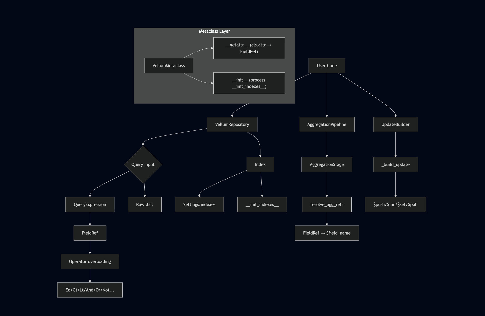

# Part 2: Architecture Decisions That Almost Broke Us

> The hard problems behind building a type-safe MongoDB ODM on top of pydantic v2.

---

Building Vellum looked straightforward on paper: wrap Motor, add type hints, call it a day. In practice, every layer of the stack pushed back. The metaclass conflicted with pydantic. The Index design fought with Python's class-body scoping rules. The build system silently refused to find our package.

Here's how we solved each one — and what we'd do differently next time.

---

## 1. The Metaclass Conflict

### The Problem

We wanted three things that don't naturally coexist:

- **pydantic's `BaseModel`** — field validation, serialisation, schema generation
- **A `HooksMixin`** — lifecycle hooks like `before_insert`, `after_insert`
- **A custom metaclass** — intercept `cls.fieldname` to return `FieldRef`

The MRO looked innocent enough:

```python
class VellumBaseModel(HooksMixin, BaseModel, metaclass=VellumMetaclass):
    ...
```

But `HooksMixin` inherited from `type` (making it a metaclass), and `BaseModel` uses `ModelMetaclass`. You can't have a class with two metaclass parents unless one derives from the other.

But you CAN'T reference `Product.name` inside the class body — `Product` doesn't exist yet.

```
Class Body (Product doesn't exist yet)
    Index(Product.name) → NameError: Product not defined

After class creation
    Product.price < 10 → Works fine via metaclass
```

### The Solution

Two APIs that cover both use cases:

**1. `Settings.indexes`** — for simple, static indexes:

```python
class Product(VellumBaseModel):
    name: str
    price: float
    category: str

    class Settings:
        indexes = [
            Index("name"),                    # string ref — works in class body
            Index(("price", 1), ("name", 1)),  # tuples — no FieldRef needed
            [("category", 1)],
        ]
```

**2. `__init_indexes__`** — classmethod that runs AFTER the class exists, so `cls.name` works:

```python
class Product(VellumBaseModel):
    name: str
    price: float
    category: str

    @classmethod
    def __init_indexes__(cls):
        return [
            Index(cls.name),                   # cls.name → FieldRef — works here
            Index(cls.price, cls.name),
            Index(cls.price.desc()),
        ]
```

This works because `VellumMetaclass.__init__` calls `__init_indexes__` after pydantic has fully set up the class:

```python
class VellumMetaclass(ModelMetaclass):
    def __init__(cls, name, bases, namespace, **kwargs):
        super().__init__(name, bases, namespace, **kwargs)
        init_indexes = cls.__init_indexes__()
        if init_indexes:
            current = getattr(cls.Settings, "indexes", [])
            cls.Settings.indexes = [*current, *init_indexes]
```

The `Index` class itself uses lazy validation — it stores the raw fields and validates them in `ensure_indexes()` against the actual model schema:

```python
class Index:
    def __init__(self, *fields: FieldRef | SortSpec | str, **options):
        self._raw_fields = list(fields)
        self._options = options

    @classmethod
    def resolve(cls, value):
        if isinstance(value, Index):
            return value
        if isinstance(value, dict):
            return cls(**value)  # may fail later
        return value

    def validate(self, model_cls):
        for field in self._raw_fields:
            if isinstance(field, FieldRef):
                assert field._field in model_cls.__pydantic_fields__
```

This design means:
- String refs work in class body (no forward reference)
- Type-safe `cls.name` syntax works via `__init_indexes__`
- Raw dict format (`[("category", 1)]`) still supported
- Validation happens at runtime in `ensure_indexes()`, not at class creation

---

## 4. The Build System Trap

### The Problem

We used `poetry-core` as the build backend. Our package was named `vellum-odm` with a `src/` layout:

```
vellum-odm/
├── pyproject.toml
└── src/
    └── vellum/
        ├── __init__.py
        └── ...
```

Poetry couldn't find the package. Poetry's build backend expects the package directory to match the package name, or to be in the project root. `src/` layout + hypenated name was a dead end.

### The Solution

We switched to `hatchling`, which handles PEP 621 natively:

```toml
[build-system]
requires = ["hatchling"]
build-backend = "hatchling.build"

[project]
name = "vellum-odm"
version = "0.1.0"
```

Hatchling respects `src/` layout out of the box. The package name in `pyproject.toml` (`vellum-odm`) and the import name (`vellum`) can differ without issue — hatchling auto-discovers packages in `src/`.

---

## 5. The `$push` Bug

### The Problem

The `UpdateBuilder.push()` method collected values into a list, then assigned the dict directly to `$push`:

```python
# After: UpdateBuilder.push(Product.tags, "sale")
self._pushes = {"tags": ["sale"]}
# Generated: {"$push": {"tags": ["sale"]}}
# MongoDB interprets this as pushing ["sale"] as a SINGLE element
```

The result: `tags` became `["mobile", "5g", ["sale"]]` instead of `["mobile", "5g", "sale"]`.

### The Fix

Check how many values are being pushed — if it's one, use the value directly; if multiple, wrap in `$each`:

```python
if self._pushes:
    push_update = {}
    for f, values in self._pushes.items():
        if len(values) == 1:
            push_update[f] = values[0]
        else:
            push_update[f] = {"$each": values}
    update["$push"] = push_update
```

Now a single `push` emits `{"$push": {"tags": "sale"}}` (correct), and multiple calls emit `{"$push": {"tags": {"$each": ["sale", "clearance"]}}}`.

---

## Summary: Architecture at a Glance



In Part 3, we'll look at the tradeoffs — what we won, what we lost, and when you should (and shouldn't) use this approach.
