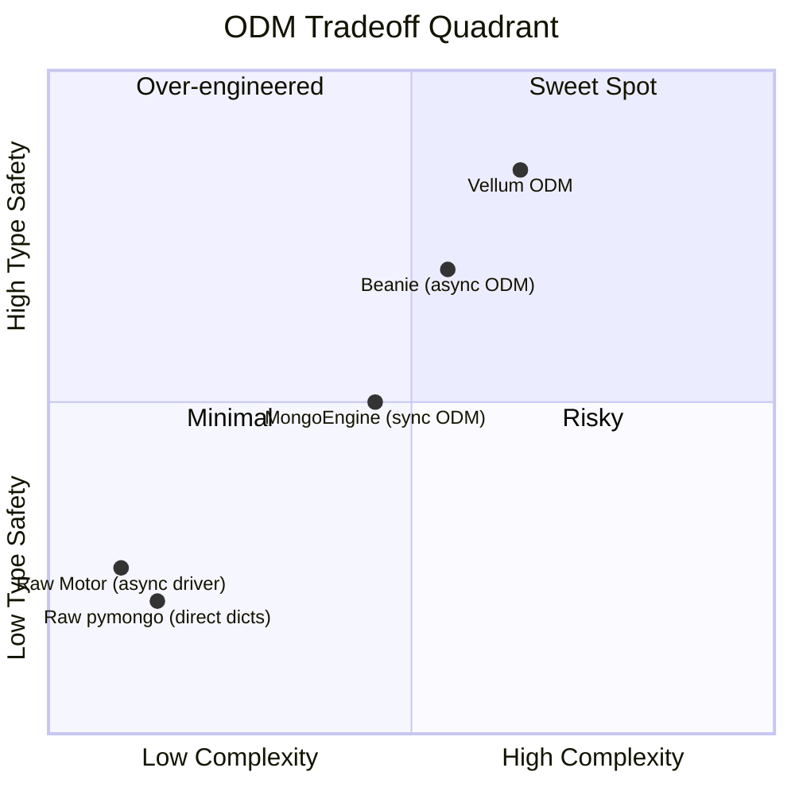

# Part 3: What We Won, What We Lost

> An honest retrospective on building a type-safe MongoDB ODM — the wins, the scars, and the edge cases that keep us humble.

---

Every abstraction is a bet. You trade some flexibility for safety, some simplicity for power. Vellum is no different. After shipping v0.1, here's what the ledger looks like.

---

## What We Won

### 1. Zero-String Queries

This is the headline feature, and it genuinely delivers:

```python
# Before (raw pymongo)
products = await collection.find({
    "category": "electronics",
    "price": {"$gte": 10, "$lte": 500},
    "tags": {"$in": ["sale", "clearance"]},
    "deleted_at": None,
}).sort([("price", -1)]).to_list(None)

# After (Vellum)
products = await repo.find(
    (Product.category == "electronics")
    & (Product.price >= 10)
    & (Product.price <= 500)
    & (Product.tags.in_(["sale", "clearance"]))
    & ~Product.is_deleted(),
    sort=[Product.price.desc()],
)
```

The second version is:
- **Shorter** — 7 lines → 10 lines (but each line is simpler)
- **Discoverable** — Ctrl+Space shows available fields
- **Refactorable** — rename `category` to `product_category`? All queries update automatically
- **Composable** — conditions are Python objects, you can store, combine, reuse them

### 2. Composable Expression Trees

Query expressions are first-class values. You can build them incrementally:

```python
# Build a dynamic filter without string concatenation
def build_product_filter(filters: ProductFilters) -> QueryExpression | None:
    conditions = []
    if filters.min_price is not None:
        conditions.append(Product.price >= filters.min_price)
    if filters.max_price is not None:
        conditions.append(Product.price <= filters.max_price)
    if filters.categories:
        conditions.append(Product.category.in_(filters.categories))
    if filters.only_available:
        conditions.append(Product.stock > 0)
    if not conditions:
        return None
    return functools.reduce(operator.and_, conditions)
```

This is type-safe, testable, and composable. No string interpolation, no `if` ladders building dicts, no risk of `$and` vs `$or` confusion.

### 3. Consistent API Across Operations

The same `FieldRef` syntax works everywhere — queries, sorts, indexes, aggregations, updates:

```python
# Query
repo.find(Product.price < 10)

# Sort
repo.find(sort=[Product.price.desc()])

# Index
Index(cls.price.desc(), cls.name.asc())

# Aggregation
pipeline.group(Order.product_id, total={"$sum": Order.total})

# Update
UpdateBuilder(repo.collection, doc_id).inc(Product.stock, -1).push(Product.tags, "sold")
```

One concept, six use cases. The learning curve is shallow — once you understand `FieldRef`, you know the whole API.

### 4. Gradual Adoption

Raw dicts still work everywhere. You can migrate model by model, or even query by query:

```python
# Fully typed
products = await repo.find(Product.price < 10)

# Mixed — no problem
products = await repo.find(
    {"price": {"$lt": 10}},
    sort=[Product.price.desc()],
)

# Fully raw
products = await repo.find(
    {"price": {"$lt": 10}},
    sort=[("price", -1)],
)
```

This is critical for existing projects. You don't need a rewrite — just start using typed expressions for new queries.

### 5. Aggregation Without `$` Strings

Aggregation pipelines are notorious for `$field` string references. Vellum auto-converts `FieldRef` objects:

```python
pipeline = AggregationPipeline(collection)
results = await (
    pipeline
    .match(Order.total > 100)
    .group(Order.product_id, total_revenue={"$sum": Order.total})
    .sort(SortSpec("total_revenue", -1))
    .execute()
)
```

`Order.total` inside `{"$sum": Order.total}` is automatically resolved to `"$total"` by `resolve_agg_refs`. No `$` prefix, no string literals.

---

## What We Lost

### 1. Metaclass Complexity

The custom metaclass (`VellumMetaclass`) is the single most fragile part of the codebase. It couples us to pydantic v2's internal attribute storage (`__pydantic_fields__`). If pydantic v3 changes how fields are stored, our metaclass breaks silently.

```python
class VellumMetaclass(ModelMetaclass):
    def __getattr__(cls, name: str):
        if name.startswith("_"):
            raise AttributeError(name)  # pydantic internals probe these
        fields = cls.__dict__.get("__pydantic_fields__", {})
        if name in fields:
            return FieldRef(name)
        raise AttributeError(...)
```

The `_` guard is a band-aid. We're catching all `_`-prefixed names and raising `AttributeError` — which is correct, but it means any future pydantic version that stores metadata under a new `_` attribute could cause subtle issues.

### 2. No `FieldRef.$` Property

You can't write `Order.$total` — `$` is not a valid Python identifier. This means the aggregation auto-conversion via `resolve_agg_refs()` is necessary, adding an extra layer of indirection that's not obvious to new users.

```python
# What we WISH worked:
Order.$total  # SyntaxError: invalid syntax

# What we have:
{"$sum": Order.total}  # resolve_agg_refs converts Order.total → "$total"
```

It works, but it's magic. Users need to understand that `FieldRef` inside a dict gets special treatment.

### 3. `__init_indexes__` Surprise

The dual API for indexes (`Settings.indexes` vs `__init_indexes__`) is necessary but ugly:

```python
class Product(VellumBaseModel):
    class Settings:
        indexes = [
            Index("name"),  # string — works in class body
        ]

    @classmethod
    def __init_indexes__(cls):
        return [
            Index(cls.price.desc()),  # FieldRef — works after class creation
        ]
```

New users consistently ask "why two ways to define indexes?" The answer (class body scoping rules) is a language detail that shouldn't leak into the API, but does.

### 4. HooksMixin Limitations

The `HooksMixin` lifecycle hooks (`before_insert`, `after_insert`) work, but they're called explicitly in the repository — not automatically. If someone calls `collection.insert_one(doc)` directly, the hooks don't fire. This is a leaky abstraction:

```python
class Order(VellumBaseModel):
    async def before_insert(self):
        self.total = self.quantity * self.unit_price  # won't fire if bypassing repo

# Repository — hooks fire
await repo.create(order)

# Direct Motor — hooks DON'T fire
await db.orders.insert_one(order.to_mongo())
```

We chose explicit over magical (hooks in `__setattr__` would be too invasive), but it means the abstraction boundary is the repository, not the model.

---

## Edge Cases We Discovered

### UUID Coercion

MongoDB stores UUIDs as strings. When querying by `_id`, users pass a `UUID` object, but MongoDB expects a string:

```python
# User writes:
repo.get(UUID("..."))  # passes UUID object

# FieldRef.__eq__ handles it:
class FieldQueryExpression:
    def _to_mongo_value(self, value):
        if isinstance(value, UUID):
            return str(value)
        return value
```

We handle this in `FieldQueryExpression._to_mongo_value()`, but it's easy to forget. Any new query operator must remember to apply this conversion.

### Optimistic Concurrency

The `OptimisticConcurrencyMixin` increments `version` on every write, but the check happens in `repository.update()` — not in `UpdateBuilder`:

```python
class VellumRepository:
    async def update(self, doc_id, item, session=None):
        if isinstance(item, OptimisticConcurrencyMixin):
            result = await self.collection.update_one(
                {"_id": doc_id, "version": item.version},
                {"$set": doc, "$inc": {"version": 1}},
                session=session,
            )
            if result.matched_count == 0:
                raise OptimisticLockError(...)
```

If someone uses `UpdateBuilder` directly, they bypass optimistic locking. The abstraction gap between repository-level operations and builder-level operations is a real source of bugs.

---

## The Tradeoff Quadrant



- **Raw pymongo/Motor**: Low complexity, low safety — you're writing JSON queries by hand
- **MongoEngine/Beanie**: Medium complexity, medium safety — some ORM patterns but still string-heavy
- **Vellum**: Higher complexity (metaclass, builder patterns), highest safety — zero-string queries, IDE support, composable expressions

---

## When to Use Vellum

**Use it when:**
- Your project has 10+ models with 50+ fields each
- Multiple developers work on the same codebase
- You refactor schemas frequently
- You want IDE autocomplete for MongoDB queries
- You're building a new project (easier than retrofitting)

**Think twice when:**
- You have 1–3 simple models
- You're migrating an existing codebase with thousands of raw queries
- You need to support pydantic v1 (we're tied to v2 internals)
- You need sync-only MongoDB (no async support)

---

## The Verdict

```mermaid
gantt
    title Vellum Development — Effort by Category
    dateFormat  YYYY-MM-DD
    axisFormat  %b %d
    section Core Engine
    FieldRef + operator overloading  :a1, 2d
    Metaclass design                  :a2, 3d
    Query expression tree             :a3, 3d
    Aggregation ref resolver          :a4, 1d
    section Integration
    Pydantic v2 compatibility         :b1, 4d
    Repository layer                  :b2, 2d
    UpdateBuilder                     :b3, 1d
    section Polish
    Index design + validation         :c1, 3d
    Build system switch               :c2, 1d
    Docs + examples                   :c3, 3d
    Bug fixes (push, restore, sort)   :c4, 1d
```

The core engine (FieldRef, metaclass, expressions) took ~40% of total development time. Integration with pydantic and Motor took another ~35%. Polish and docs took the remaining ~25%.

The metaclass work was the hardest — and the most rewarding. Once it works, the rest of the API flows naturally from it.

---

## Final Thoughts

Building Vellum taught us that type safety in a document database is a spectrum, not a binary. You can't make MongoDB statically typed — it's schemaless by design. But you can make the **interface** to MongoDB statically typed, catching field name typos and operator errors before they hit the database.

The cost is complexity in the abstraction layer. Every line of metaclass code, every `_to_mongo_value` conversion, every `resolve_agg_refs` recursive walk is a potential failure point.

But for the developer writing a query at 2 AM, the API speaks for itself:

```python
Product.price < 10
```

No strings. No `$` prefixes. No surprises. Just Python.

And that's worth the cost.
